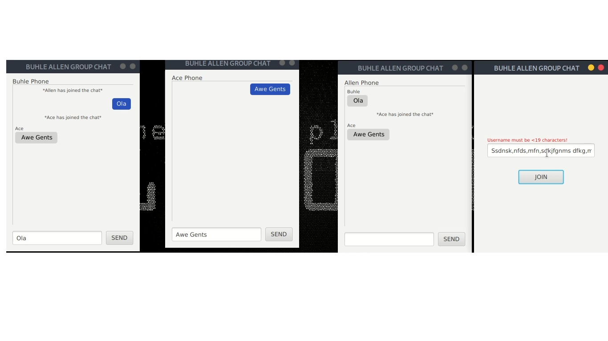
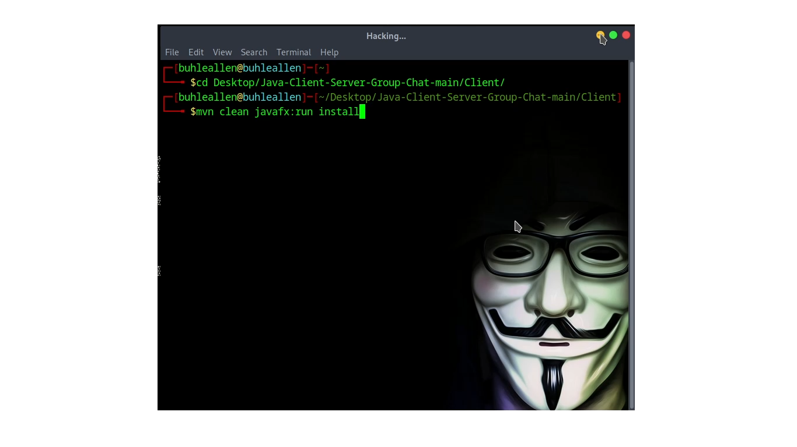

# Java-Client-Server-Group-Chat(Maven JavaFx Multithreading Application)

## Final Product
This is a Multithreading Maven JavaFx client server application that mimics a facebook group chat. Every GUI represents a group member

 

## Cloning/Downloading Project
- Download a zip file and unzip the project
### Server(Run Only One Instance of Server At Given Time)
- Open Command Line Interface and navigate to project _Server/src_

  `cd <--Path to project-->/Java-Client-Server-Group-Chat/Server/src`
  
-Delete Class files that are in the server package

  `rm server/*.class`
  
-Compile server class

  `javac server/Server.java`
  
-Run server class files

  `java server.Server`
  

### Client(Open New Command Line Interface For Every Group Member)
- Open Command Line Prompt and navigate to project _Client_
  
  `cd <--Path to project-->/Java-Client-Server-Group-Chat/Client`
  
-Delete Class files that are in the server package

  `mvn clean javafx:run install`

-Minimise the Command Line Interface as the Graphical User Interface opens
*CLIENT LEAVES GROUP CHAT BY CLOSING CLI NOT THE GUI*

# APPLICATION DEMONSTRATIONS VIDEOS
### [JAVAFX APPLICATION](https://youtu.be/LvdoniAMvtU?si=VpWv37wDliS669wd)
### [PREVIOUS VERSION - CLI APPLICATION](https://youtube.com/shorts/wf62uWOtY5I?si=7hVsnwOEW5NKwRCc)
